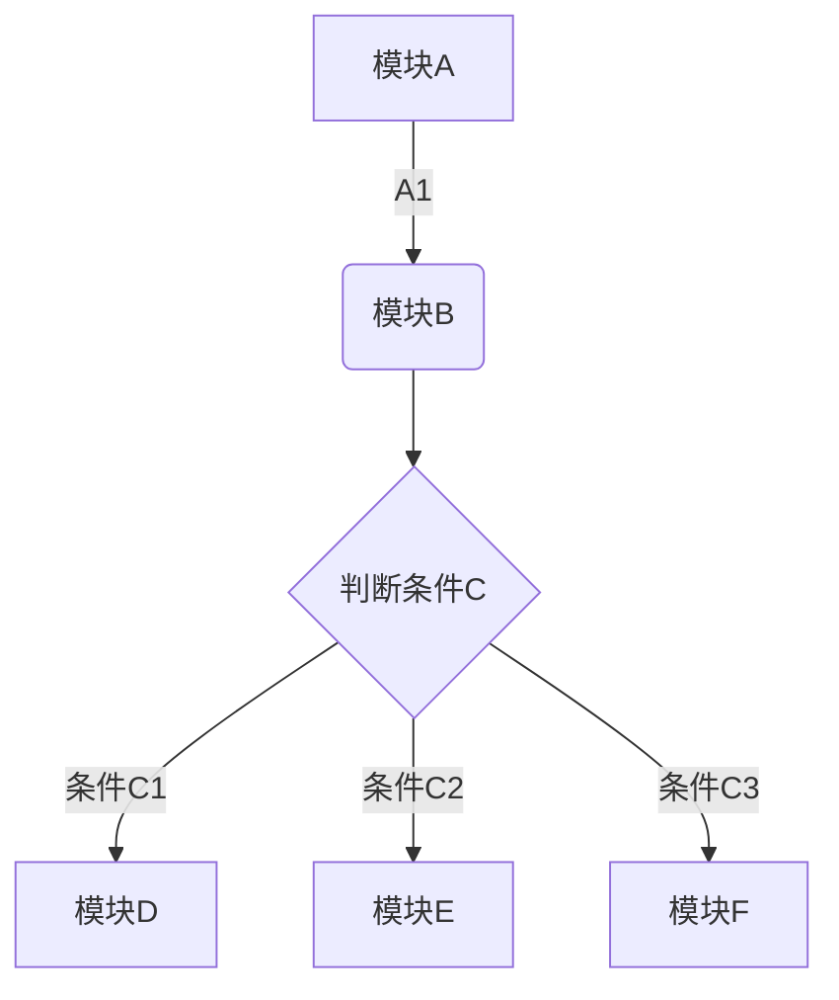
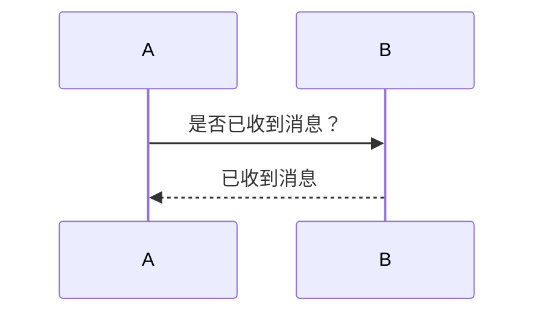

* content
{:toc}

```math
e^{i\pi} + 1 = 0
```
```math
e^{i\pi} + 1 = 0
```
```math
e^{i\pi} + 1 = 0
```

```mermaid
graph TD
A[模块A] -->|A1| B(模块B)
B --> C{判断条件C}
C -->|条件C1| D[模块D]
C -->|条件C2| E[模块E]
C -->|条件C3| F[模块F]
```

```mermaid
sequenceDiagram
A->>B: 是否已收到消息？
B-->>A: 已收到消息
```

